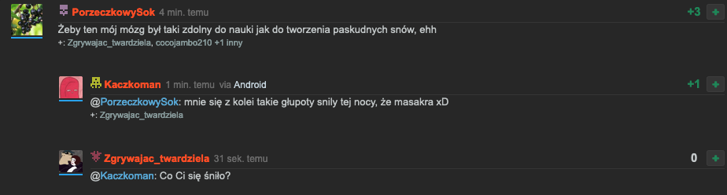

# Wykop Uniq Users Avatars

The script generates a unique avatar for each user by their nickname, so it will always be the same.

## How to install

Download [Tampermonkey](https://www.tampermonkey.net)

- [Firefox](https://addons.mozilla.org/en-US/firefox/addon/tampermonkey/)
- [Chrome](https://chrome.google.com/webstore/detail/tampermonkey/dhdgffkkebhmkfjojejmpbldmpobfkfo)
- [Opera](https://addons.opera.com/en/extensions/details/tampermonkey-beta/)
- [Safari](https://apps.apple.com/us/app/tampermonkey/id1482490089?mt=12)
- [Microsoft Edge](https://microsoftedge.microsoft.com/addons/detail/tampermonkey/iikmkjmpaadaobahmlepeloendndfphd)

After installing the addon, click on the Tampermonkey icon, click on "Add new script" a window will open in which you have to paste the contents of the [Wykop.Avatars.user.js](https://raw.githubusercontent.com/skorotkiewicz/wykop-uniq-avatar/main/Wykop.Avatars.user.js) file.

After pasting, do not forget to save the file, you can do this using the shortcut Ctrl+S or File->Save

## How it looks

